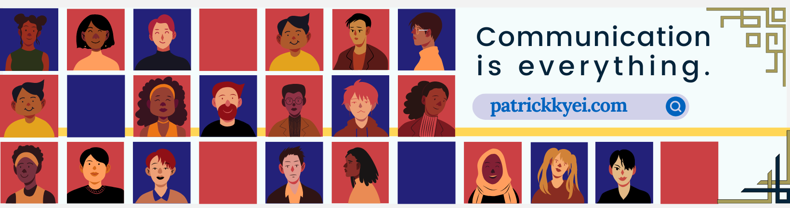

---
<p align="left"></p>

## Hey , it's Patrick here

## I create digital products that are driven by user experience


[](https://twitter.com/_patrickbaffour)


- I’m currently working on [myself](https://patrickkyei.com/about "Patrick Kyei")

- I’m currently learning [**Data Analytics**](https://patrickkyei.com/posts/data-analytics-project/ "Cyclistic Data Analytics project")

- I can help with resourceful [product tools](https://patrickkyei.com/posts/product-resource-links/ "product tools") for your product work.

- 👨‍💻 All of my projects are available at my [github repo](https://github.com/PatrickKyei "github repo")

- 📝 I regularly write articles on my [website](https://patrickkyei.com/ "website")

- 💬 Ask me about **Product Design, Product Management, Data Analytics**

- Recent [projects](https://patrickkyei.com/projects/ "Project")

* * *


- ### Connect with me

- [](https://linkedin.com/in/patrickbaffour)[](https://instagram.com/_patrickbaffour)[](https://dribbble.com/patrickbaffour)
- ### Languages and Tools:
    

[](https://angular.io) [](https://aws.amazon.com)[](https://getbootstrap.com)[](https://www.w3schools.com/css/)[](https://www.figma.com/)[](https://cloud.google.com)[](https://git-scm.com/)[](https://www.w3.org/html/)[](https://www.adobe.com/in/products/illustrator.html)[](https://developer.mozilla.org/en-US/docs/Web/JavaScript)[](https://www.linux.org/)[](https://materializecss.com/)[](https://www.mongodb.com/)[](https://nodejs.org)[](https://www.photoshop.com/en)[](https://postman.com)[](https://www.python.org)[](https://reactjs.org/)[](https://www.typescriptlang.org/)[](https://www.adobe.com/products/xd.html)

---
## 📊 Github stats

<details>
    <summary>GitHub Profile Stats</summary>
    <br/>
    <p align="center">


    </p>
</details>

---

<div align="center">
    <h3>Support Me</h3>
    <p>
        <a href="https://www.buymeacoffee.com/patrickbaffour" target="_blank">
            
        </a>
        <a href="https://ko-fi.com/patrickkyei">
            
        </a>
    </p>
</div>

<!------------------SECTION------------------------------->


## 🛠️ Technologies and Tools

<!-- <details> -->
<summary>🐱‍💻 Programming Languages and Tools that I Use</summary>
<table>
<thead>
  <tr>
    <th>Categories</th>
    <th colspan="5">Technology</th>
  </tr>
</thead>
<tbody align="center">
  <tr>
    <td>Programming Language</td>
    <td>
        
        <br>Python
    </td>
    <td>
        
        <br>JavaScript
    </td>
    <td>
        
        <br>Kotlin
    </td>
    <td>
        
        <br>PHP
    </td>
    <td>
        
        <br>Swift
    </td>
  </tr>
  <tr>
    <td>Libraries</td>
    <td>
        
        <br>Numpy
    </td>
    <td>
        
        <br>Pandas
    </td>
    <td>
        
        <br>Matplotlib
    </td>
    <td>
        
        <br>Scikit-Learn
    </td>
    <td>
        
        <br>Scrapy
    </td>
  </tr>
  <tr>
    <td>Front-End Technologies</td>
    <td>
        
        <br>Sass
    </td>
    <td>
        
        <br>Bootstrap
    </td>
    <td>
        
        <br>Tailwind
    </td>
    <td>
        
        <br>JavaScript
    </td>
    <td>
        
        <br>Vue
    </td>
  </tr>
  <tr>
    <td>Back-End Technologies</td>
    <td>
        
        <br>Django
    </td>
    <td>
        
        <br>CodeIgniter
    </td>
    <td></td>
    <td></td>
    <td></td>
  </tr>
  <tr>
    <td>Database</td>
    <td>
        
        <br>SQLite
    </td>
    <td>
        
        <br>MySQL
    </td>
    <td>
        
        <br>PostgreSQL
    </td>
    <td>
        
        <br>Firestore
    </td>
    <td>
        
        <br>Redis
    </td>
  </tr>
  <tr>
    <td>Cloud Hosting</td>
    <td>
        
        <br>GCP
    </td>
    <td>
        
        <br>AWS
    </td>
    <td>
        
        <br>Azure
    </td>
    <td>
        
        <br>Heroku
    </td>
    <td></td>
  </tr>
  <tr>
    <td rowspan="4">Software & Tools</td>
    <td>
        
        <br>Git
    </td>
    <td>
        
        <br>Jira
    </td>
    <td>
        
        <br>Pre-commit
    </td>
    <td>
        
        <br>Pycharm
    </td>
    <td>
        
        <br>Android Studio
    </td>
  </tr>
  <tr>
    <td>
        
        <br>Notion
    </td>
    <td>
        
        <br>Ubuntu
    </td>
    <td>
        
        <br>MacOS
    </td>
    <td>
        
        <br>Windows
    </td>
    <td>
        
        <!-- <br>Figma -->
    </td>
  </tr>
  <tr>
    <td>
        
        <br>IntelliJ IDEA
    </td>
    <td>
        
        <br>Webpack
    </td>
    <td>
        
        <br>CircleCI
    </td>
    <td>
        
        <br>TravisCI
    </td>
    <td>
        
        <br>Github Actions
    </td>
  </tr>
  <tr>
    <td>
        
        <br>Github
    </td>
    <td>
        
        <br>Jupyter Notebook
    </td>
    <td>
        
        <br>Mypy
    </td>
    <td>
        
        <br>PIP
    </td>
    <td>
        
        <br>Postman
    </td>
  </tr>
  <tr>
    <td>Linters & Code Formatters</td>
    <td>
        
        <br>ESlint
    </td>
    <td>
        
        <br>Stylelint
    </td>
    <td>
        
        <br>Pylint
    </td>
    <td>
        Flake8
    </td>
    <td>
        
        <br>Black
    </td>
  </tr>
</tbody>
</table>
<!-- </details> -->
---

<!------------------SECTION------------------------------->

<!-- 
📊 **This Week I Spent My Time On**

```text
⌚︎ Time Zone: Accra/UTC

💬 Programming Languages: 
Python                   3 hrs 46 mins       █████████████░░░░░░░░░░░░   55.4% 
YAML                     1 hr 16 mins        ████░░░░░░░░░░░░░░░░░░░░░   18.79% 
INI                      38 mins             ██░░░░░░░░░░░░░░░░░░░░░░░   9.45% 
Text                     38 mins             ██░░░░░░░░░░░░░░░░░░░░░░░   9.35% 
requirements-pro.txt     18 mins             █░░░░░░░░░░░░░░░░░░░░░░░░   4.61%

🔥 Editors: 
PyCharm                  6 hrs 42 mins       ████████████████████████░   98.21% 
VS Code                  7 mins              ░░░░░░░░░░░░░░░░░░░░░░░░░   1.79%

🐱‍💻 Projects: 
oneBarangay-REST-API     6 hrs 44 mins       ████████████████████████░   98.85% 
docker                   4 mins              ░░░░░░░░░░░░░░░░░░░░░░░░░   1.15%

💻 Operating System: 
Windows                  6 hrs 44 mins       ████████████████████████░   98.85% 
Linux                    4 mins              ░░░░░░░░░░░░░░░░░░░░░░░░░   1.15% -->
